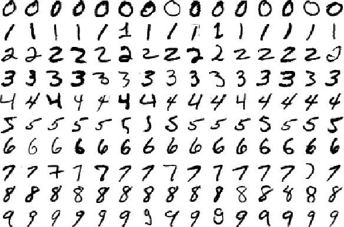
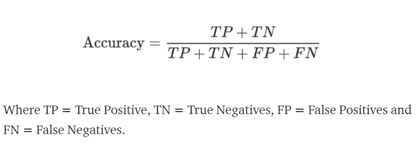

# MNIST Classification using Neural Network 



> ### Classify hand-written digits images in MNIST dataset


## Table of Contents

- [Introduction](#introduction) 
- [Objective](#objective)
- [Dataset](#dataset)
- [Evaluation Criteria](#evaluation-criteria)
- [Solution Approach](#solution-approach)
- [How To Use](#how-to-use)
- [License](#license)
- [Author Info](#author-info)

---

## Introduction
The Modified National Institute of Standards and Technology (MIST) dataset was prepared by combining two of National Institute of Standards and Technology (NIST) databases. These databases contained the images of hand-written digits by high school students and employees of the United States Census Bureau. The MNIST dataset is widely used in academia for training and testing machine-learning model. MNIST dataset classification is possibly one of the very first task an aspiring ML/DL learner encounters. I tend to think this as the "Hello World" for classification tasks where one can experiments with various ML and DL models. MNIST is an extremely good dataset for people who wish to try machine learning techniques on a real-world dataset with very little time and effort on data-preparation and pre-processing which is the most time consuming task in data-science projects.   


---
## Objective
We'll build a neural network using PyTorch to discriminate between digits 0 to 9 in MNIST dataset.

---
## Dataset
- Dataset consists on 60,000 training images and 10,000 training images.
- Images may belong to any of the 10 classes (digits 0 to 9)
- Each image in the dataset is 28x28 pixel gray scale image, a zoomed in single images shown below...


- Here are few more samples of other digits images from the training dataset with their respective labels...


- We will use the in-built MNIST dataset from PyTorch's `torchvision` package. The advantage of of using the dataset this way is that we get a clean pre-processed dataset which pairs the image and respective label nicely making our life easier when we iterate through the image samples while training and testing the model. Alternatively the raw dataset can be downloaded from the original source [here](http://yann.lecun.com/exdb/mnist/). The raw dataset comes as a set of zip files containing training images, training image labels, testing images and testing image labels in separate files.

---

## Evaluation Criteria

### Loss Function  
Negative Log Likelyhood Loss (NLLLoss) is used as the loss function during model training and validation 


<br>Note the `negative` sign in front `NLLLoss` formula (and in `BCELoss` formula as well) hence negative in the name. Negative sign is put in front to make the overall average loss positive. If we don't do this then, since `log` of a number less than 1 is negative, we will end-up with negative overall average loss which means in order to reduce the loss we need to `maximize` the loss function instead of `minimizing` which is a much easier task mathematically than `maximizing`.


### Performance Metric

`accuracy` is used as the model's performance metric on the test-set 



---
## Solution Approach
- Training dataset of 60,000 images and labels along with testing dataset of 10,000 images and labels are downloaded from torchvision.
- The training dataset is then split into 20% of validation set (12,000 images) and 80% of training set (48,000 images)
- The training, validation and testing datasets are then wrapped in PyTorch `DataLoaders` objects so that we can iterate through them with ease. A typical `batch_size` 32 is used.
- The neural network is implemented as a subclass of `nn.Module` PyTorch class. Network has an input, 2 hidden layer (784 and 128 nodes) and a output layer with 10 nodes. Hidden layers use `ReLU` activation function. Output layer uses `LogSoftmax` activation. A 25% dropout regularization is used after each of the hidden-layer output. Images of size 28x28 are flattened before they are fed to the network as a 784 element long vector. A high-level network schematic is shown below...


- Network is trained and validated for 10 epochs using `NLLLoss` function and `Adam` optimizer with a learning rate of 0.001.
- We keep track of training and validation losses. When plotted we observe that model starts to `overfit` around 5th epoch.


- During the validation we compare the current validation loss with previous validation loss and save the model of validation loss has `decreased` further, this way we'll end-up with best model saved and not the model from last epoch which could be a model that overfits (as we can see from plot above)
- The trained model is then evaluated on unseen test dataset. For this we first load the saved model and then make prediction on 10,000 testing images.
- For each digit label we keep track of prediction accuracy as correct-prediction/total-number-of-images. Network is able to achive around `97.52%` accuracy. The test result summary is shown below...


---
## How To Use
1. Ensure below listed packages are installed
    - `numpy`
    - `matplotlib`
    - `torch`
    - `torchvision`
2. Download `mnist_classification_nn_pytorch.ipynb` jupyter notebook from this repo
3. Execute the notebook from start to finish in one go. If a GPU is available (recommended) then it'll use it automatically else it'll fall back to CPU. 
4. On a machine with `NVIDIA Quadro P5000` GPU with 16GB memory it approximately takes 5-7 minutes to train and validate for 10 epochs.
5. A trained model has been provided as part of this repo, `MNIST_model.pth`. The trained model can be loaded and used for prediction as shown in below code snippet... 

```python
    # Load model with the trained wights
    weights = torch.load('MNIST_model.pth')
    model = Network()
    model.load_state_dict(weights)
    # move model to the available device
    device = 'cuda' if torch.cuda.is_available() else 'cpu'
    model = model.to(device)
    proba = torch.exp(model(image)) 
    _, pred_label = torch.max(proba, dim=1)
    print(pred_label)
```

---


---
## License

MIT License

Copyright (c) [2021] [Sunil S. Singh]

Permission is hereby granted, free of charge, to any person obtaining a copy
of this software and associated documentation files (the "Software"), to deal
in the Software without restriction, including without limitation the rights
to use, copy, modify, merge, publish, distribute, sublicense, and/or sell
copies of the Software, and to permit persons to whom the Software is
furnished to do so, subject to the following conditions:

The above copyright notice and this permission notice shall be included in all
copies or substantial portions of the Software.

THE SOFTWARE IS PROVIDED "AS IS", WITHOUT WARRANTY OF ANY KIND, EXPRESS OR
IMPLIED, INCLUDING BUT NOT LIMITED TO THE WARRANTIES OF MERCHANTABILITY,
FITNESS FOR A PARTICULAR PURPOSE AND NONINFRINGEMENT. IN NO EVENT SHALL THE
AUTHORS OR COPYRIGHT HOLDERS BE LIABLE FOR ANY CLAIM, DAMAGES OR OTHER
LIABILITY, WHETHER IN AN ACTION OF CONTRACT, TORT OR OTHERWISE, ARISING FROM,
OUT OF OR IN CONNECTION WITH THE SOFTWARE OR THE USE OR OTHER DEALINGS IN THE
SOFTWARE.

---

## Author Info

- Twitter - [@sunilssingh6](https://twitter.com/sunilssingh6)
- Linkedin - [Sunil S. Singh](https://linkedin.com/in/sssingh)

[Back To The Top](#Credit-Card-Fraud-Detection)

---
